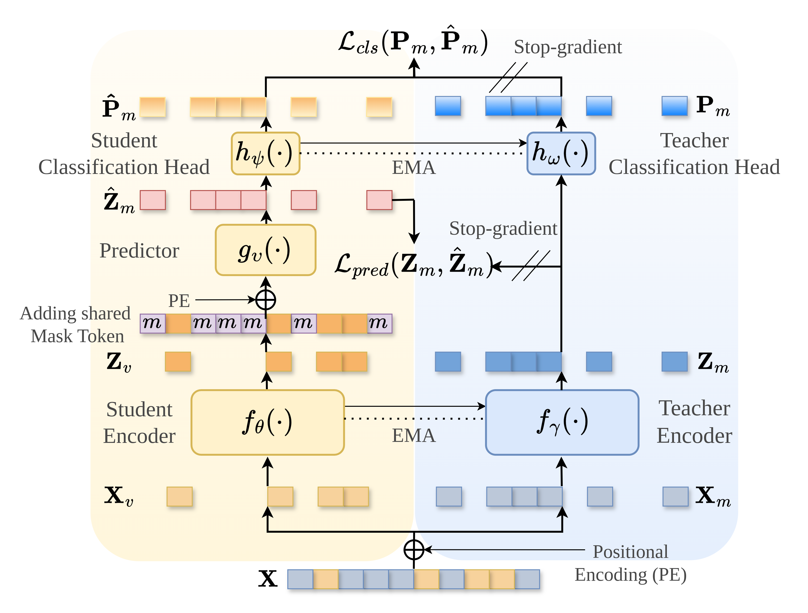
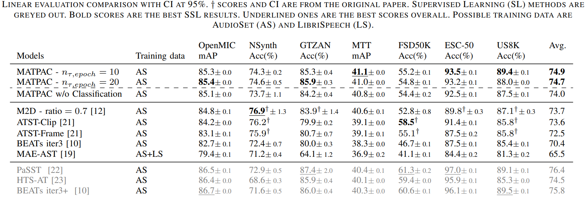

# MATPAC: Masked latent Prediction And Classification

**tl;dr**: MATPAC is powerful general audio fundation model.

This repository provides the training code, in fairseq framework, as well as an easy to use inference code from our paper [📝 Masked Latent Prediction and Classification for Self-Supervised Audio Representation Learning](https://ieeexplore.ieee.org/document/10887666)



## Table of Contents
- [MATPAC: Masked latent Prediction And Classification](#matpac-masked-latent-prediction-and-classification)
  - [Table of Contents](#table-of-contents)
  - [Inference code](#inference-code)
  - [Training code](#training-code)
  - [Benchmarks](#benchmarks)
  - [Citation](#citation)
  - [Credits](#credits)

## Inference code

The package [inference_matpac](./inference_matpac/) enables you to easily pip install the inference code to use MATPAC as a feature extractor from audio files.

```bash
pip install -e ./inference_matpac 
```

You can find more detail on how to use the inference code [here](./inference_matpac/README.md).

## Training code

The training code is available for reproducibility [here](./training_matpac/). We used [fairseq](https://github.com/facebookresearch/fairseq) as a training framework, therefore our code follows its guidelines which makes it easy to run. 
You can find a detailed explanation on how to run the model [here](./training_matpac/README.md).

## Benchmarks
MATPAC outperforms other self-supervised baselines on datasets such as OpenMIC, GTZAN, Magna-tag-a-tune, ESC-50 and US8K. It even outperforms supervised baselines on Magna-tag-a-tune.




## Citation

If you use this work, please cite:
```bibtex
@inproceedings{quelennec2025matpac,
  title={Masked Latent Prediction and Classification for Self-Supervised Audio Representation Learning}, 
  author={Quelennec, Aurian and Chouteau, Pierre and Peeters, Geoffroy and Essid, Slim},
  booktitle={ICASSP 2025 - 2025 IEEE International Conference on Acoustics, Speech and Signal Processing (ICASSP)}, 
  year={2025},
  url={https://ieeexplore.ieee.org/document/10887666},
  doi={10.1109/ICASSP49660.2025.10887666}}
```

---

## Credits

- [Fairseq](https://github.com/facebookresearch/fairseq) for the training framework. 
- [M2D](https://github.com/nttcslab/m2d/tree/master) for the base of the code.
- [DINO](https://github.com/facebookresearch/dino) for the classification head.

```bibtex
@inproceedings{niizumi2023m2d,
    title={{Masked Modeling Duo: Learning Representations by Encouraging Both Networks to Model the Input}},
    author={Niizumi, Daisuke and Takeuchi, Daiki and Ohishi, Yasunori and Harada, Noboru and Kashino, Kunio},
    booktitle={ICASSP 2023 - 2023 IEEE International Conference on Acoustics, Speech and Signal Processing (ICASSP)}, 
    year={2023},
    url={https://ieeexplore.ieee.org/document/10097236},
    doi={10.1109/ICASSP49357.2023.10097236}}


@inproceedings{caron2021dino,
  title={Emerging Properties in Self-Supervised Vision Transformers}, 
  author={Caron, Mathilde and Touvron, Hugo and Misra, Ishan and Jegou, Hervé and Mairal, Julien and Bojanowski, Piotr and Joulin, Armand},
  booktitle={2021 IEEE/CVF International Conference on Computer Vision (ICCV)}, 
  year={2021},
  url={https://ieeexplore.ieee.org/document/9709990},
  doi={10.1109/ICCV48922.2021.00951}}
```
