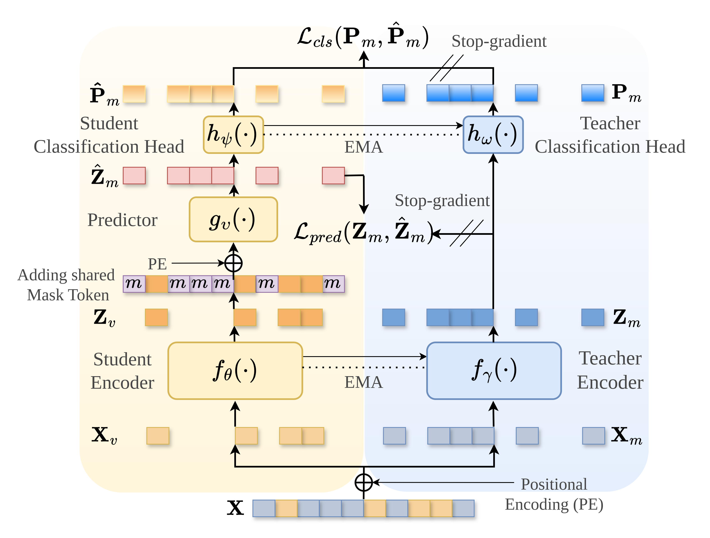
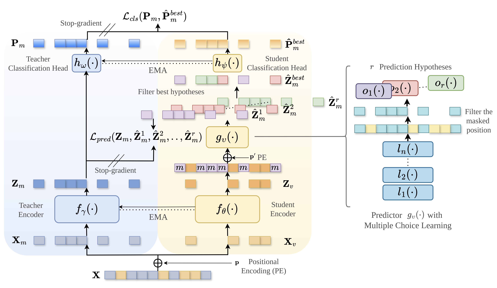
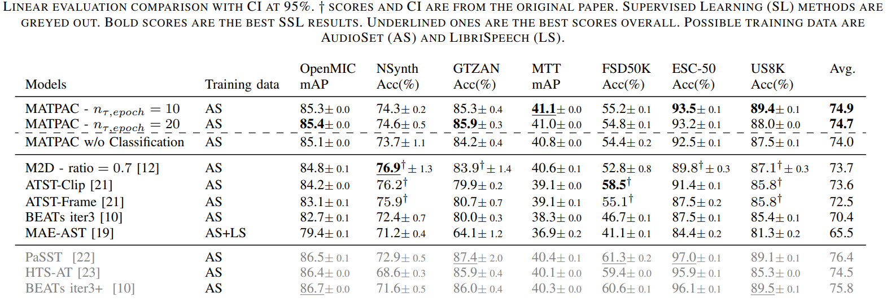

# MATPAC: Masked latent Prediction And Classification

**tl;dr**: MATPAC is a SOTA audio and music encoder trained in Self-Supervised Learning.

<p align="center">
  <a href="https://huggingface.co/auriankelen"></a>
  <a href="https://arxiv.org/abs/2502.12031"></a>
  <a href="https://arxiv.org/abs/2508.12709"></a>
  <a href="./LICENSE"></a>
</p>

**The models are on the 🤗 Hub** — load any of them with `transformers` in three lines,
no need to clone this repo: see [Models on Hugging Face](#models-on-hugging-face).

This repository provides the training code, in the fairseq framework, as well as an easy-to-use inference code from our papers:
- [📝 MATPAC: Masked Latent Prediction and Classification for Self-Supervised Audio Representation Learning](https://arxiv.org/abs/2502.12031)
- [📝 MATPAC++: Enhanced Masked Latent Prediction for Self-Supervised Audio Representation Learning](https://arxiv.org/pdf/2508.12709)


<p align="center">
  <figure>
    <figcaption>Diagram of MATPAC: </figcaption>
    
  </figure>
  <figure>
    <figcaption>Diagram of MATPAC++: </figcaption>
    
  </figure>
</p>


## Table of Contents
- [MATPAC: Masked latent Prediction And Classification](#matpac-masked-latent-prediction-and-classification)
  - [Table of Contents](#table-of-contents)
  - [Models on Hugging Face](#models-on-hugging-face)
  - [Inference code](#inference-code)
  - [Training code](#training-code)
  - [Benchmarks](#benchmarks)
  - [Citation](#citation)
  - [Derived works](#derived-works)
  - [Credits](#credits)

## Models on Hugging Face

Every MATPAC++ checkpoint is published on the 🤗 Hub as a `transformers`-native,
`trust_remote_code` port of the [inference code](./inference_matpac/). They all share the
same `configuration_matpac.py` / `modeling_matpac.py` and differ only by `config.json`,
so the snippet below works for any of them — just swap the repo id.

| Repo | Trained on | Output | Notes |
|---|---|---|---|
| [matpac_general_audio](https://huggingface.co/auriankelen/matpac_general_audio) | General audio (AudioSet) | 3840-d embeddings | Default general-purpose audio encoder |
| [matpac_music](https://huggingface.co/auriankelen/matpac_music) | Music | 3840-d embeddings | Music-specialized encoder |
| [matpac_audioset_finetune_encoder](https://huggingface.co/auriankelen/matpac_audioset_finetune_encoder) | AudioSet (fine-tuned) | 3840-d embeddings | Fine-tuned encoder, no classification head |
| [matpac_audioset_finetune_classifier](https://huggingface.co/auriankelen/matpac_audioset_finetune_classifier) | AudioSet (fine-tuned) | 527-way logits | Ready-to-use AudioSet tagger |

```python
from transformers import AutoModel, Wav2Vec2FeatureExtractor
import torch, torchaudio

repo = "auriankelen/matpac_general_audio"
model = AutoModel.from_pretrained(repo, trust_remote_code=True)
processor = Wav2Vec2FeatureExtractor.from_pretrained(repo, trust_remote_code=True)

waveform, sr = torchaudio.load("my_file.wav")
waveform = waveform.mean(dim=0)  # mono
if sr != processor.sampling_rate:
    waveform = torchaudio.transforms.Resample(sr, processor.sampling_rate)(waveform)

inputs = processor(waveform, sampling_rate=processor.sampling_rate, return_tensors="pt")
with torch.no_grad():
    outputs = model(**inputs)
# outputs.last_hidden_state -> embeddings; outputs.logits -> class scores (classifier repo)
```

Beyond `transformers`, this needs `torchaudio`, `einops` and `timm==0.4.12` (that exact
`timm`: the ViT block submodule names must match the exported weights), plus a decoding
backend for `torchaudio.load` — `soundfile`, or `torchcodec` on torchaudio >= 2.9.

The classifier repo also ships
[`matpac_youtube_app.py`](https://huggingface.co/auriankelen/matpac_audioset_finetune_classifier/blob/main/matpac_youtube_app.py),
a small demo that tags any YouTube video and shows which AudioSet classes fire over
time, with the heatmap playhead following the video.

## Inference code

The package [inference_matpac](./inference_matpac/) enables you to easily pip install the inference code to use MATPAC as a feature extractor from audio files.
You can find the model weights [here](https://github.com/aurianworld/matpac/releases/download/Initial_release/matpac_10_2048.pt).

```bash
pip install -e ./inference_matpac 
```

You can find more details on how to use the inference code [here](./inference_matpac/README.md).

## Training code

The training code is available for reproducibility [here](./training_matpac/). We used [fairseq](https://github.com/facebookresearch/fairseq) as a training framework; therefore, our code follows its guidelines, which makes it easy to run. 
You can find a detailed explanation on how to run the model [here](./training_matpac/README.md).

## Benchmarks
MATPAC and MATPAC++ outperforms other self-supervised baselines on datasets such as OpenMIC, GTZAN, Magna-tag-a-tune, ESC-50 and US8K. It even outperforms supervised baselines on Magna-tag-a-tune.




## Citation

If you use this work, please cite:
```bibtex
@inproceedings{quelennec2025matpac,
  title={Masked Latent Prediction and Classification for Self-Supervised Audio Representation Learning}, 
  author={Quelennec, Aurian and Chouteau, Pierre and Peeters, Geoffroy and Essid, Slim},
  booktitle={ICASSP 2025 - 2025 IEEE International Conference on Acoustics, Speech and Signal Processing (ICASSP)}, 
  year={2025},
  url={https://ieeexplore.ieee.org/document/10887666},
  doi={10.1109/ICASSP49660.2025.10887666}}

@article{quelennec2025matpacenhancedmaskedlatent,
      title={MATPAC++: Enhanced Masked Latent Prediction for Self-Supervised Audio Representation Learning}, 
      author={Aurian Quelennec and Pierre Chouteau and Geoffroy Peeters and Slim Essid},
      journal={arXiv preprint arXiv:2508.12709},
      year={2025},
      url={https://arxiv.org/abs/2508.12709}, 
}
```

## Derived works

MATPAC++ has been used as the primary audio encoder in the following works, further demonstrating its effectiveness:
- [TinyMU](https://github.com/xiquan-li/TinyMU) - MATPAC++ serves as the audio encoder in a compact audio-language model (ALM) that achieves performance comparable to AudioFlamingo and Qwen-Audio while using only 300M parameters.
- [S-SONDO](https://github.com/MedAliAdlouni/ssondo) - MATPAC++ is distilled into a lightweight CNN-based model that is 31× smaller while retaining 96% of the teacher model's performance.

---

## Credits

- [Fairseq](https://github.com/facebookresearch/fairseq) for the training framework. 
- [M2D](https://github.com/nttcslab/m2d/tree/master) for the base of the code.
- [DINO](https://github.com/facebookresearch/dino) for the classification head.

```bibtex
@inproceedings{niizumi2023m2d,
  title={{Masked Modeling Duo: Learning Representations by Encouraging Both Networks to Model the Input}},
  author={Niizumi, Daisuke and Takeuchi, Daiki and Ohishi, Yasunori and Harada, Noboru and Kashino, Kunio},
  booktitle={ICASSP 2023 - 2023 IEEE International Conference on Acoustics, Speech and Signal Processing (ICASSP)}, 
  year={2023},
  url={https://ieeexplore.ieee.org/document/10097236},
  doi={10.1109/ICASSP49357.2023.10097236}}


@inproceedings{caron2021dino,
  title={Emerging Properties in Self-Supervised Vision Transformers}, 
  author={Caron, Mathilde and Touvron, Hugo and Misra, Ishan and Jegou, Hervé and Mairal, Julien and Bojanowski, Piotr and Joulin, Armand},
  booktitle={2021 IEEE/CVF International Conference on Computer Vision (ICCV)}, 
  year={2021},
  url={https://ieeexplore.ieee.org/document/9709990},
  doi={10.1109/ICCV48922.2021.00951}}
```
